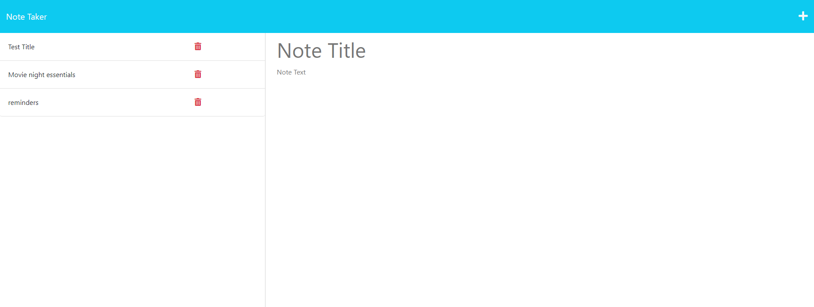

# note-taker-express

## Description
This project was built to stregthen the knowledge of express and also make a useful application for taking notes that actually stores you notes. 
##### Deployed Application
https://note-taker-express-nysat-b3aa373588ff.herokuapp.com/
##### Screenshot

## Table of contents
* [Description](#description)
* [Installation](#installation)
* [Usage](#usage)
* [Contributing](#contributing)
* [License](#license)
* [Test](#test)
* [Questions](#questions)
## Installation 
n/a
## Usage
How to use this application: Press 'get started' and then add a note title and text however the user desires. and then click the 'cross' icon on the top-right to save the notes that where taken. To delete any notes taken just click the 'red trash can' next to any notes you wish to delete.
## Contributing
n/a
## License
This project is licensed under the  license. 
## Test
n/a
## Questions 
If there is any questions please send your questions [here](nysatrejo3@gmail.com) or visit [github/nysat](https://github.com/nysat).
